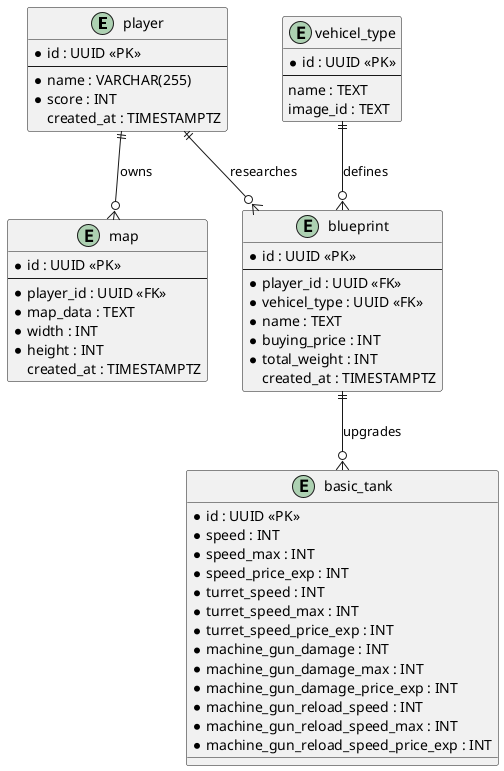

# Database Layout

| Field | Value |
|-------|-------|
| **Purpose & Intent** | Document the persistent data model — tables, columns, types, and relationships — as the single reference for all backend data access. |
| **Incoming** | DTO structs in `src/backend/src/` (`player_dto.rs`, `map_dto.rs`, `blueprint_dto.rs`) and SQL migrations in `src/backend/migrations/` |
| **Outgoing** | Ch. 5 Building Block View (backend component), Ch. 6 Runtime View (data-access scenarios), Ch. 9 Architecture Decisions (schema choices) |

---

## Entity-Relationship Diagram

## Tables

### `player`

| Column | Type | Constraints | Notes |
|--------|------|-------------|-------|
| `id` | UUID | PK, NOT NULL | |
| `name` | VARCHAR(255) | NOT NULL | |
| `score` | INT | NOT NULL | |
| `created_at` | TIMESTAMPTZ | DEFAULT NOW() | |

### `map`

| Column | Type | Constraints | Notes |
|--------|------|-------------|-------|
| `id` | UUID | PK, NOT NULL | |
| `player_id` | UUID | FK → player.id, NOT NULL | Owning player |
| `map_data` | TEXT | NOT NULL | Serialised map content |
| `width` | INT | NOT NULL | |
| `height` | INT | NOT NULL | |
| `created_at` | TIMESTAMPTZ | DEFAULT NOW() | |

### `blueprint`

| Column | Type | Constraints | Notes |
|--------|------|-------------|-------|
| `id` | UUID | PK, NOT NULL | |
| `player_id` | UUID | FK → player.id, NOT NULL | Owning player |
| `combat_unit` | TEXT | NOT NULL | Unit type identifier |
| `created_at` | TIMESTAMPTZ | DEFAULT NOW() | |

## DTO Mapping

| Table | DTO struct | Notable differences |
|-------|-----------|---------------------|
| `player` | `PlayerDto` | `created_at` not exposed in DTO |
| `map` | `MapDto` | `player_id` not exposed; `created_at` is `Option<String>` |
| `blueprint` | `BlueprintDto` | Maps `combat_unit` column as `name`; exposes `research_cost` (not yet in DB schema) |
