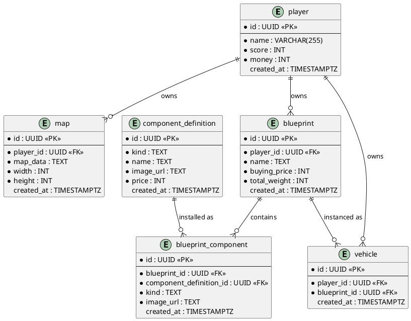

# Database Layout

| Field | Value |
|-------|-------|
| **Purpose & Intent** | Document the current persistent data model for players, maps, blueprints, component definitions, installed blueprint components, and planned vehicle instances. |
| **Incoming** | DTO structs in `src/backend/src/` (`player_dto.rs`, `map_dto.rs`, `blueprint_dto.rs`) and SQL migrations in `src/backend/migrations/` |
| **Outgoing** | Ch. 5 Building Block View (backend component), Ch. 6 Runtime View (data-access scenarios), Ch. 9 Architecture Decisions (schema choices) |

---

## Scope

This document captures the current relational tables in the backend database and the next planned `vehicle` table. The component catalog is stored as seeded component definitions, and installed blueprint parts are represented in `blueprint_component`.

---

## Entity-Relationship Diagram

## Tables

### `player`

| Column | Type | Constraints | Notes |
|--------|------|-------------|-------|
| `id` | UUID | PK, NOT NULL | |
| `name` | VARCHAR(255) | NOT NULL | |
| `score` | INT | NOT NULL | |
| `money` | INT | NOT NULL | |
| `created_at` | TIMESTAMPTZ | DEFAULT NOW() | |

### `map`

| Column | Type | Constraints | Notes |
|--------|------|-------------|-------|
| `id` | UUID | PK, NOT NULL | |
| `player_id` | UUID | FK → player.id, NOT NULL | Owning player |
| `map_data` | TEXT | NOT NULL | Serialised map content |
| `width` | INT | NOT NULL | |
| `height` | INT | NOT NULL | |
| `created_at` | TIMESTAMPTZ | DEFAULT NOW() | |

### `blueprint`

| Column | Type | Constraints | Notes |
|--------|------|-------------|-------|
| `id` | UUID | PK, NOT NULL | |
| `player_id` | UUID | FK → player.id, NOT NULL | Owning player |
| `name` | TEXT | NOT NULL | Blueprint name |
| `buying_price` | INT | NOT NULL | Cached total cost |
| `total_weight` | INT | NOT NULL | Cached total weight |
| `created_at` | TIMESTAMPTZ | DEFAULT NOW() | |

### `component_definition`

| Column | Type | Constraints | Notes |
|--------|------|-------------|-------|
| `id` | UUID | PK, NOT NULL | |
| `kind` | TEXT | NOT NULL | Component category; currently used for chassis filters |
| `name` | TEXT | NOT NULL | Human-readable name |
| `image_url` | TEXT | NOT NULL | Frontend asset path |
| `price` | INT | NOT NULL | Purchase price |
| `created_at` | TIMESTAMPTZ | DEFAULT NOW() | |

### `blueprint_component`

| Column | Type | Constraints | Notes |
|--------|------|-------------|-------|
| `id` | UUID | PK, NOT NULL | |
| `blueprint_id` | UUID | FK → blueprint.id, NOT NULL | Owning blueprint |
| `component_definition_id` | UUID | FK → component_definition.id, NOT NULL | Installed component definition |
| `kind` | TEXT | NOT NULL | Denormalized from component definition for fast filtering |
| `image_url` | TEXT | NOT NULL | Denormalized from component definition for UI projection |
| `created_at` | TIMESTAMPTZ | DEFAULT NOW() | |

### `vehicle`

| Column | Type | Constraints | Notes |
|--------|------|-------------|-------|
| `id` | UUID | PK, NOT NULL | |
| `player_id` | UUID | FK → player.id, NOT NULL | Owning player of the bought unit |
| `blueprint_id` | UUID | FK → blueprint.id, NOT NULL | Blueprint this vehicle was bought from |
| `created_at` | TIMESTAMPTZ | DEFAULT NOW() | Purchase timestamp |

## DTO Mapping

| Table | DTO struct | Notable differences |
|-------|-----------|---------------------|
| `player` | `PlayerDto` | `money` and `score` are exposed; `created_at` is not |
| `map` | `MapDto` | `created_at` is `Option<String>` |
| `blueprint` | `BlueprintDto` | Includes `player_id`, `name`, `buying_price`, `total_weight` |
| `component_definition` | `ComponentDefinitionDto` | Maps catalog rows to API-visible component definitions |
| `blueprint_component` | no direct DTO yet | Used as an internal relation table for installed blueprint parts |
| `vehicle` | no direct DTO yet | Likely to require aggregation with blueprint and component definition data |

## Notes

- The existing `component_definition` catalog is the current source of buyable chassis definitions.
- `blueprint_component` currently stores a flat blueprint-to-component-definition relation plus denormalized display/filter fields (`kind`, `image_url`) for query simplification.
- Denormalized fields should be treated as snapshot values copied at insert time; updates to `component_definition` do not automatically propagate.
- `vehicle` is intended to represent bought instances of a blueprint, separate from the blueprint design itself.
- Database reads should stay in the DAO/repository layer; DTOs should remain request/response shapes only.
- This layout is meant to support a CLI seed step in the backend so the component catalog can be created reproducibly.
- A future `VehicleDto` will likely be aggregated rather than a 1:1 table mapping, for example by joining blueprint and component definition data for display fields like image path.
