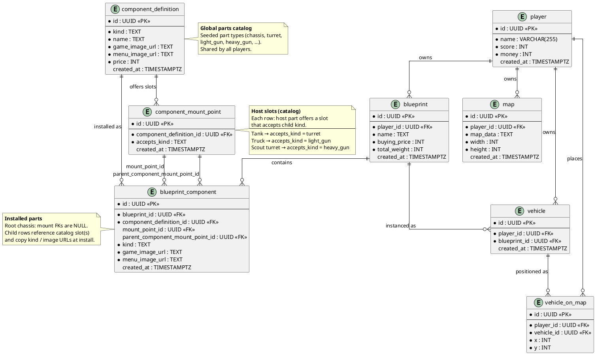

# Database Layout

| Field | Value |
|-------|-------|
| **Purpose & Intent** | Document the current persistent data model for players, maps, blueprints, component catalog, mount points, installed blueprint components, vehicles, and map placement. |
| **Incoming** | DTO structs in `src/backend/src/` and SQL migrations in `src/backend/migrations/` |
| **Outgoing** | Ch. 5 Building Block View (backend component), Ch. 6 Runtime View (data-access scenarios), Ch. 9 Architecture Decisions ([ADR-001](../09_architecture_decisions/ADR-001-component-model-and-storage.md)) |

---

## Scope

This document reflects the schema in `20260529195524_create_tank_wars_table.up.sql`. The component catalog (`component_definition`, `component_mount_point`) is seeded globally; player-owned designs use `blueprint` and `blueprint_component`; bought units use `vehicle` and `vehicle_on_map`.

Mount compatibility (v1): a child may attach to a parent host when `child.kind = mount_point.accepts_kind`. See [TW-1](../../tickets/TW-1-allow-buying-turret-component.md).

---

## Entity-Relationship Diagram



---

## Tables

### `player`

| Column | Type | Constraints | Notes |
|--------|------|-------------|-------|
| `id` | UUID | PK, NOT NULL | |
| `name` | VARCHAR(255) | NOT NULL | |
| `score` | INT | NOT NULL | |
| `money` | INT | NOT NULL | |
| `created_at` | TIMESTAMPTZ | DEFAULT NOW() | |

### `map`

| Column | Type | Constraints | Notes |
|--------|------|-------------|-------|
| `id` | UUID | PK, NOT NULL | |
| `player_id` | UUID | FK → player.id, NOT NULL | Owning player |
| `map_data` | TEXT | NOT NULL | Serialised map content |
| `width` | INT | NOT NULL | |
| `height` | INT | NOT NULL | |
| `created_at` | TIMESTAMPTZ | DEFAULT NOW() | |

### `blueprint`

| Column | Type | Constraints | Notes |
|--------|------|-------------|-------|
| `id` | UUID | PK, NOT NULL | |
| `player_id` | UUID | FK → player.id, NOT NULL | Owning player |
| `name` | TEXT | NOT NULL | Blueprint name |
| `buying_price` | INT | NOT NULL | Cached total cost |
| `total_weight` | INT | NOT NULL | Cached total weight |
| `created_at` | TIMESTAMPTZ | DEFAULT NOW() | |

### `component_definition`

Global **parts catalog**: one row per buyable/mountable part type (Tank chassis, Scout turret, Light MG, …).

| Role | Description |
|------|-------------|
| Catalog | `component_definition` — what parts exist? |
| Slots on host | `component_mount_point` — which child `kind` values can mount here? |
| Installation | `blueprint_component` — which parts are on a player blueprint? |

**Seeded kinds (v1):** `chassis`, `turret`, `light_gun`, `heavy_gun`.

| Column | Type | Constraints | Notes |
|--------|------|-------------|-------|
| `id` | UUID | PK, NOT NULL | |
| `kind` | TEXT | NOT NULL | Part category; used for mount matching |
| `name` | TEXT | NOT NULL | Human-readable name |
| `game_image_url` | TEXT | NOT NULL | Frontend asset path for gameplay |
| `menu_image_url` | TEXT | NOT NULL | Frontend asset path for menus |
| `price` | INT | NOT NULL | Purchase price |
| `created_at` | TIMESTAMPTZ | DEFAULT NOW() | |

### `component_mount_point`

Slots a **host** catalog part offers. A child mounts when `child.component_definition.kind = accepts_kind`.

| Column | Type | Constraints | Notes |
|--------|------|-------------|-------|
| `id` | UUID | PK, NOT NULL | |
| `component_definition_id` | UUID | FK → component_definition.id, NOT NULL | Host that offers the slot (e.g. Tank chassis) |
| `accepts_kind` | TEXT | NOT NULL | Required `kind` on the child part |
| `created_at` | TIMESTAMPTZ | DEFAULT NOW() | |

**Seeded mount graph (v1):**

| Host | `accepts_kind` |
|------|----------------|
| Tank (`chassis`) | `turret` |
| Truck (`chassis`) | `light_gun` |
| Scout (`turret`) | `heavy_gun` |

### `blueprint_component`

**Installed parts** on a player blueprint. Copies `kind`, `game_image_url`, and `menu_image_url` from `component_definition` at install time (snapshots).

| Column | Type | Constraints | Notes |
|--------|------|-------------|-------|
| `id` | UUID | PK, NOT NULL | |
| `blueprint_id` | UUID | FK → blueprint.id, NOT NULL | Owning blueprint |
| `component_definition_id` | UUID | FK → component_definition.id, NOT NULL | Installed part from catalog |
| `mount_point_id` | UUID | FK → component_mount_point.id, NULL | Catalog slot this installation uses; NULL for root chassis |
| `parent_component_mount_point_id` | UUID | FK → component_mount_point.id, NULL | Present in schema; see assembly notes below |
| `kind` | TEXT | NOT NULL | Denormalized snapshot |
| `game_image_url` | TEXT | NOT NULL | Denormalized snapshot |
| `menu_image_url` | TEXT | NOT NULL | Denormalized snapshot |
| `created_at` | TIMESTAMPTZ | DEFAULT NOW() | |

**Assembly notes:**

- Root chassis row: `mount_point_id` and `parent_component_mount_point_id` are `NULL`.
- Child rows reference the catalog slot used via `mount_point_id` (and/or `parent_component_mount_point_id` per current migration).
- `parent_blueprint_component_id` is **not** in the schema yet; [ADR-001](../09_architecture_decisions/ADR-001-component-model-and-storage.md) recommends adding it for an explicit assembly tree.

**Example trees:**

```text
Tank blueprint
└─ blueprint_component (chassis: Tank)
   └─ blueprint_component (turret: Scout)     → Tank turret mount_point
      └─ blueprint_component (weapon: Main Gun) → Scout heavy_gun mount_point

Truck blueprint
└─ blueprint_component (chassis: Truck)
   └─ blueprint_component (weapon: Light MG)   → Truck light_gun mount_point
```

### `vehicle`

| Column | Type | Constraints | Notes |
|--------|------|-------------|-------|
| `id` | UUID | PK, NOT NULL | |
| `player_id` | UUID | FK → player.id, NOT NULL | Owning player |
| `blueprint_id` | UUID | FK → blueprint.id, NOT NULL | Blueprint this vehicle was built from |
| `created_at` | TIMESTAMPTZ | DEFAULT NOW() | |

### `vehicle_on_map`

| Column | Type | Constraints | Notes |
|--------|------|-------------|-------|
| `id` | UUID | PK, NOT NULL | |
| `player_id` | UUID | FK → player.id, NOT NULL | Map owner |
| `vehicle_id` | UUID | FK → vehicle.id, NOT NULL | Placed vehicle |
| `x` | INT | NOT NULL | Grid x |
| `y` | INT | NOT NULL | Grid y |

---

## DTO Mapping

| Table | DTO struct | Notable differences |
|-------|-----------|---------------------|
| `player` | `PlayerDto` | `money` and `score` exposed; `created_at` not |
| `map` | `MapDto` | `created_at` as `Option<String>` |
| `blueprint` | `BlueprintDto` | `player_id`, `name`, `buying_price`, `total_weight` |
| `component_definition` | `ComponentDefinitionDto` | Exposes image URLs and `price` |
| `component_mount_point` | none yet | Internal catalog; used by mount validator |
| `blueprint_component` | none yet | Internal; chassis resolved via `kind = 'chassis'` in vehicle DTOs |
| `vehicle` | `VehicleDto` (partial) | Aggregates chassis `game_image_url` from blueprint assembly |
| `vehicle_on_map` | `VehicleOnMapDto` | Position + resolved display fields |

---

## Notes

- `component_mount_point` is global catalog data, seeded with hosts in `src/backend/src/seed.rs`.
- Mount rule at install: `child.kind` must equal `component_mount_point.accepts_kind` on the parent host.
- Denormalized fields on `blueprint_component` are install-time snapshots; catalog changes do not propagate.
- `vehicle` is a bought instance of a `blueprint`; `vehicle_on_map` stores grid placement per player.
- Vehicle DTOs currently read **chassis only** (`kind = 'chassis'`); TW-1 will extend assembly-aware display.
- DAO layer owns reads/writes; DTOs remain API shapes only.
- Planned schema additions (ADR-001 / TW-1): `parent_blueprint_component_id` on `blueprint_component`, optional `UNIQUE (component_definition_id, accepts_kind)` on mount points.
