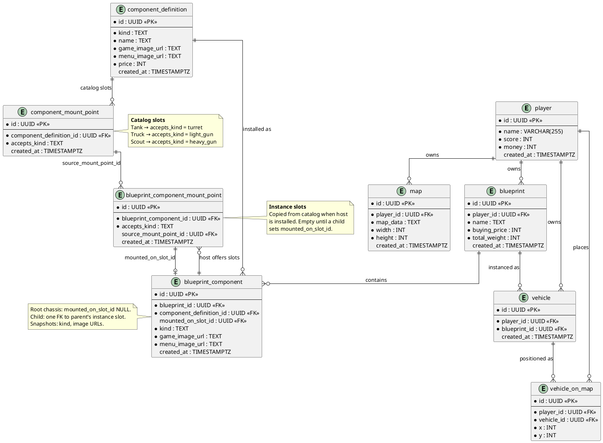

# Database Layout

| Field | Value |
|-------|-------|
| **Purpose & Intent** | Document the persistent data model for players, maps, blueprints, component catalog, mount points, installed blueprint components, vehicles, and map placement. |
| **Incoming** | DTO structs in `src/backend/src/` and SQL migrations in `src/backend/migrations/` |
| **Outgoing** | Ch. 5 Building Block View (backend component), Ch. 6 Runtime View (data-access scenarios), Ch. 9 Architecture Decisions ([ADR-001](../09_architecture_decisions/ADR-001-component-model-and-storage.md)) |

---

## Scope

This document describes the **target schema** for blueprint assembly (catalog + instance mount points). See [Migration drift](#migration-drift) for differences from the current SQL migration.

Three layers:

| Layer | Tables | Role |
|-------|--------|------|
| **Catalog** | `component_definition`, `component_mount_point` | Global, seeded part types and the slots each host type offers |
| **Blueprint design** | `blueprint`, `blueprint_component`, `blueprint_component_mount_point` | Player-owned design: installed parts and **instance** slots copied from catalog |
| **Fleet / map** | `vehicle`, `vehicle_on_map` | Bought units and map placement |

Mount rule (v1): a child may attach when `child.kind = blueprint_component_mount_point.accepts_kind` on an **empty** instance slot of the parent host. See [TW-1](../../tickets/TW-1-allow-buying-turret-component.md).

---

## Catalog vs. instance mount points

```text
component_mount_point (catalog)
  "Tank chassis offers a turret slot"
        │ copied when host is installed on a blueprint
        ▼
blueprint_component_mount_point (instance)
  "This Tank on blueprint #7 has an empty turret slot"
        ▲
        │ child references this slot (parent implied)
blueprint_component (child)
  mounted_on_slot_id → instance slot row
```

- **Catalog** (`component_mount_point`) — shared by all players; defines what a part type *can* offer.
- **Instance** (`blueprint_component_mount_point`) — per installed host on one blueprint; defines what *this* chassis/turret offers right now.
- **Child** (`blueprint_component`) — points at the parent's **instance slot**, not at the catalog. The parent does not reference children.

---

## Entity-Relationship Diagram



---

## Tables

### `player`

| Column | Type | Constraints | Notes |
|--------|------|-------------|-------|
| `id` | UUID | PK, NOT NULL | |
| `name` | VARCHAR(255) | NOT NULL | |
| `score` | INT | NOT NULL | |
| `money` | INT | NOT NULL | |
| `created_at` | TIMESTAMPTZ | DEFAULT NOW() | |

### `map`

| Column | Type | Constraints | Notes |
|--------|------|-------------|-------|
| `id` | UUID | PK, NOT NULL | |
| `player_id` | UUID | FK → player.id, NOT NULL | Owning player |
| `map_data` | TEXT | NOT NULL | Serialised map content |
| `width` | INT | NOT NULL | |
| `height` | INT | NOT NULL | |
| `created_at` | TIMESTAMPTZ | DEFAULT NOW() | |

### `blueprint`

| Column | Type | Constraints | Notes |
|--------|------|-------------|-------|
| `id` | UUID | PK, NOT NULL | |
| `player_id` | UUID | FK → player.id, NOT NULL | Owning player |
| `name` | TEXT | NOT NULL | Blueprint name |
| `buying_price` | INT | NOT NULL | Cached total cost |
| `total_weight` | INT | NOT NULL | Cached total weight |
| `created_at` | TIMESTAMPTZ | DEFAULT NOW() | |

### `component_definition`

Global **parts catalog**: one row per buyable/mountable part type.

**Seeded kinds (v1):** `chassis`, `turret`, `light_gun`, `heavy_gun`.

| Column | Type | Constraints | Notes |
|--------|------|-------------|-------|
| `id` | UUID | PK, NOT NULL | |
| `kind` | TEXT | NOT NULL | Part category; used for mount matching |
| `name` | TEXT | NOT NULL | Human-readable name |
| `game_image_url` | TEXT | NOT NULL | Frontend asset path for gameplay |
| `menu_image_url` | TEXT | NOT NULL | Frontend asset path for menus |
| `price` | INT | NOT NULL | Purchase price |
| `created_at` | TIMESTAMPTZ | DEFAULT NOW() | |

### `component_mount_point`

**Catalog slots** — what a host part type offers globally.

| Column | Type | Constraints | Notes |
|--------|------|-------------|-------|
| `id` | UUID | PK, NOT NULL | |
| `component_definition_id` | UUID | FK → component_definition.id, NOT NULL | Catalog host (e.g. Tank chassis) |
| `accepts_kind` | TEXT | NOT NULL | Required `kind` on the child part |
| `created_at` | TIMESTAMPTZ | DEFAULT NOW() | |

**Seeded catalog graph (v1):**

| Host | `accepts_kind` |
|------|----------------|
| Tank (`chassis`) | `turret` |
| Truck (`chassis`) | `light_gun` |
| Scout (`turret`) | `heavy_gun` |

### `blueprint_component`

**Installed part** on a player blueprint.

| Column | Type | Constraints | Notes |
|--------|------|-------------|-------|
| `id` | UUID | PK, NOT NULL | |
| `blueprint_id` | UUID | FK → blueprint.id, NOT NULL | Owning blueprint |
| `component_definition_id` | UUID | FK → component_definition.id, NOT NULL | Installed part from catalog |
| `mounted_on_slot_id` | UUID | FK → blueprint_component_mount_point.id, NULL | Parent's instance slot; NULL for root chassis |
| `kind` | TEXT | NOT NULL | Snapshot from catalog at install |
| `game_image_url` | TEXT | NOT NULL | Snapshot |
| `menu_image_url` | TEXT | NOT NULL | Snapshot |
| `created_at` | TIMESTAMPTZ | DEFAULT NOW() | |

When a host part is installed, copy its catalog mount points into `blueprint_component_mount_point` rows owned by that `blueprint_component`.

### `blueprint_component_mount_point`

**Instance slot** on an installed host — copied from catalog at install time.

| Column | Type | Constraints | Notes |
|--------|------|-------------|-------|
| `id` | UUID | PK, NOT NULL | |
| `blueprint_component_id` | UUID | FK → blueprint_component.id, NOT NULL | Installed host that offers this slot |
| `accepts_kind` | TEXT | NOT NULL | Copied from catalog; child must match |
| `source_mount_point_id` | UUID | FK → component_mount_point.id, NULL | Optional traceability to catalog row (ID of the component_mount_point this point is generated from) |
| `created_at` | TIMESTAMPTZ | DEFAULT NOW() | |

**Slot occupancy:** a slot is empty when no `blueprint_component` row has `mounted_on_slot_id` pointing at it. At most one child per instance slot.

**Finding the parent host** from a child: `child.mounted_on_slot_id` → `blueprint_component_mount_point.blueprint_component_id`.

### `vehicle`

| Column | Type | Constraints | Notes |
|--------|------|-------------|-------|
| `id` | UUID | PK, NOT NULL | |
| `player_id` | UUID | FK → player.id, NOT NULL | Owning player |
| `blueprint_id` | UUID | FK → blueprint.id, NOT NULL | Blueprint this vehicle was built from |
| `created_at` | TIMESTAMPTZ | DEFAULT NOW() | |

### `vehicle_on_map`

| Column | Type | Constraints | Notes |
|--------|------|-------------|-------|
| `id` | UUID | PK, NOT NULL | |
| `player_id` | UUID | FK → player.id, NOT NULL | Map owner |
| `vehicle_id` | UUID | FK → vehicle.id, NOT NULL | Placed vehicle |
| `x` | INT | NOT NULL | Grid x |
| `y` | INT | NOT NULL | Grid y |

---

## Constraints & indexes (target)

Apply in the follow-up migration that introduces instance mount points:

| Table | Constraint | Purpose |
|-------|------------|---------|
| `component_mount_point` | `UNIQUE (component_definition_id, accepts_kind)` | One catalog slot per kind per host |
| `blueprint_component_mount_point` | `UNIQUE (blueprint_component_id, accepts_kind)` | One instance slot per kind per installed host |
| `blueprint_component` | Index on `mounted_on_slot_id` | Child lookup and slot occupancy checks |

Slot occupancy is enforced in application logic (no child may reference the same `blueprint_component_mount_point.id`); a partial unique index on `mounted_on_slot_id` WHERE NOT NULL is optional if the DB should enforce it.

---

## Install flow (v1)

**1. Buy chassis (root)**

- Insert `blueprint_component` with `mounted_on_slot_id = NULL`.
- For each `component_mount_point` on the chassis definition, insert `blueprint_component_mount_point` on that row.

**2. Mount child (e.g. turret on Tank)**

- Find an instance slot on the parent host where `accepts_kind = child.kind` and slot is empty.
- Insert `blueprint_component` with `mounted_on_slot_id` → that slot.
- Copy catalog mount points from the child's definition → new instance slots on the child row.

**3. Validation**

- `child.kind` must equal target slot's `accepts_kind`.
- Target slot must have no existing child (`mounted_on_slot_id` unused).

---

## Assembly examples

**Tank blueprint**

```text
bc1  blueprint_component (Tank chassis)     mounted_on_slot_id: NULL
  bcmp1  instance slot (accepts turret)    ← empty, then occupied
    bc2  blueprint_component (Scout)       mounted_on_slot_id → bcmp1
      bcmp2  instance slot (accepts heavy_gun)
        bc3  blueprint_component (Main Gun) mounted_on_slot_id → bcmp2
```

**Truck blueprint**

```text
bc1  blueprint_component (Truck chassis)    mounted_on_slot_id: NULL
  bcmp1  instance slot (accepts light_gun)
    bc2  blueprint_component (Light MG)      mounted_on_slot_id → bcmp1
```

---

## DTO Mapping

| Table | DTO struct | Notable differences |
|-------|-----------|---------------------|
| `player` | `PlayerDto` | `money` and `score` exposed |
| `map` | `MapDto` | `created_at` as `Option<String>` |
| `blueprint` | `BlueprintDto` | `player_id`, `name`, `buying_price`, `total_weight` |
| `component_definition` | `ComponentDefinitionDto` | Image URLs and `price` |
| `component_mount_point` | none yet | Catalog; read when copying instance slots |
| `blueprint_component` | none yet | Assembly; chassis resolved via `kind = 'chassis'` in vehicle DTOs today |
| `blueprint_component_mount_point` | none yet | Instance slots; drives empty-slot UI |
| `vehicle` | `VehicleDto` (partial) | Chassis image only until TW-1 assembly DTO |
| `vehicle_on_map` | `VehicleOnMapDto` | Position + display fields |

---

## Migration drift

The migration `20260529195524_create_tank_wars_table.up.sql` **does not yet match** this target. Current code has:

| Current | Target |
|---------|--------|
| `blueprint_component.mount_point_id` | Remove — use instance layer |
| `blueprint_component.parent_component_mount_point_id` | Remove — use `mounted_on_slot_id` |
| (missing) | Add `blueprint_component_mount_point` |
| (missing) | Add `blueprint_component.mounted_on_slot_id` |

A follow-up migration should introduce `blueprint_component_mount_point` and replace the dual catalog FKs on `blueprint_component`. Apply the [constraints & indexes](#constraints--indexes-target) when doing so.

**Related docs:** [ADR-001](../09_architecture_decisions/ADR-001-component-model-and-storage.md) (decision rationale), [TW-1](../../tickets/TW-1-allow-buying-turret-component.md) (implementation plan).

---

## Notes

- Catalog mount points are seeded in `src/backend/src/seed.rs`; instance slots are created at install time.
- Denormalized fields on `blueprint_component` are install-time snapshots.
- Empty-slot UI reads `blueprint_component_mount_point` for a selected host and excludes slots already referenced by `mounted_on_slot_id`.
- DAO layer owns reads/writes; DTOs remain API shapes only.
