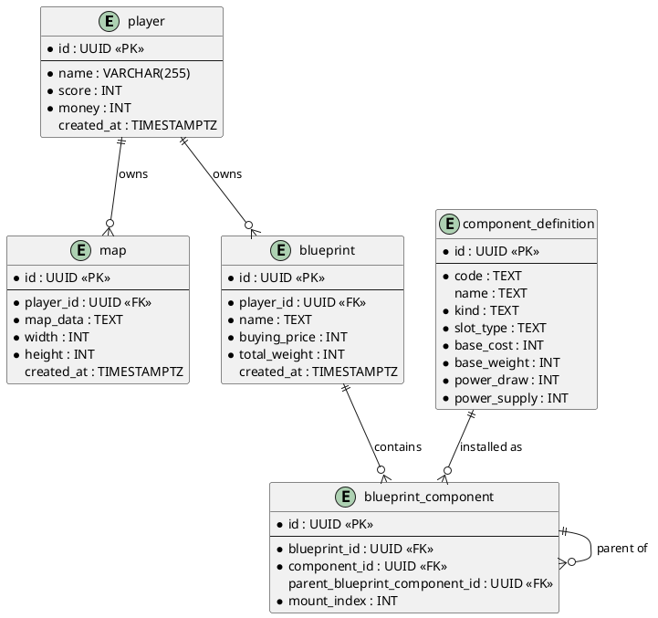

# Database Layout

| Field | Value |
|-------|-------|
| **Purpose & Intent** | Document the current persistent data model for players, maps, blueprints, and component definitions. |
| **Incoming** | DTO structs in `src/backend/src/` (`player_dto.rs`, `map_dto.rs`, `blueprint_dto.rs`) and SQL migrations in `src/backend/migrations/` |
| **Outgoing** | Ch. 5 Building Block View (backend component), Ch. 6 Runtime View (data-access scenarios), Ch. 9 Architecture Decisions (schema choices) |

---

## Scope

This document captures the current relational tables in the backend database. The component catalog is stored as seeded component definitions, and installed blueprint parts are represented in `blueprint_component`.

---

## Entity-Relationship Diagram

## Tables

### `player`

| Column | Type | Constraints | Notes |
|--------|------|-------------|-------|
| `id` | UUID | PK, NOT NULL | |
| `name` | VARCHAR(255) | NOT NULL | |
| `score` | INT | NOT NULL | |
| `money` | INT | NOT NULL | |
| `created_at` | TIMESTAMPTZ | DEFAULT NOW() | |

### `map`

| Column | Type | Constraints | Notes |
|--------|------|-------------|-------|
| `id` | UUID | PK, NOT NULL | |
| `player_id` | UUID | FK → player.id, NOT NULL | Owning player |
| `map_data` | TEXT | NOT NULL | Serialised map content |
| `width` | INT | NOT NULL | |
| `height` | INT | NOT NULL | |
| `created_at` | TIMESTAMPTZ | DEFAULT NOW() | |

### `blueprint`

| Column | Type | Constraints | Notes |
|--------|------|-------------|-------|
| `id` | UUID | PK, NOT NULL | |
| `player_id` | UUID | FK → player.id, NOT NULL | Owning player |
| `name` | TEXT | NOT NULL | Blueprint name |
| `buying_price` | INT | NOT NULL | Cached total cost |
| `total_weight` | INT | NOT NULL | Cached total weight |
| `created_at` | TIMESTAMPTZ | DEFAULT NOW() | |

### `component_definition`

| Column | Type | Constraints | Notes |
|--------|------|-------------|-------|
| `id` | UUID | PK, NOT NULL | |
| `kind` | TEXT | NOT NULL | Component category; currently used for chassis filters |
| `name` | TEXT | NOT NULL | Human-readable name |
| `image_url` | TEXT | NOT NULL | Frontend asset path |
| `price` | INT | NOT NULL | Purchase price |
| `created_at` | TIMESTAMPTZ | DEFAULT NOW() | |

### `blueprint_component`

| Column | Type | Constraints | Notes |
|--------|------|-------------|-------|
| `id` | UUID | PK, NOT NULL | |
| `blueprint_id` | UUID | FK → blueprint.id, NOT NULL | Owning blueprint |
| `component_id` | UUID | FK → component_definition.id, NOT NULL | Installed component |
| `parent_blueprint_component_id` | UUID | FK → blueprint_component.id, NULL | Parent/child attachment |
| `mount_index` | INT | NOT NULL | Slot index for repeated mounts |

### `component_tag`

| Column | Type | Constraints | Notes |
|--------|------|-------------|-------|
| `component_id` | UUID | FK → component_definition.id, NOT NULL | |
| `tag` | TEXT | PK part, NOT NULL | Examples: `light`, `turret-capable` |

### `component_requirement`

| Column | Type | Constraints | Notes |
|--------|------|-------------|-------|
| `id` | UUID | PK, NOT NULL | |
| `component_id` | UUID | FK → component_definition.id, NOT NULL | Component being constrained |
| `requirement_type` | TEXT | NOT NULL | `component` or `tag` |
| `required_component_id` | UUID | FK → component_definition.id, NULL | For component requirements |
| `required_tag` | TEXT | NULL | For tag requirements |

### `component_incompatibility`

| Column | Type | Constraints | Notes |
|--------|------|-------------|-------|
| `id` | UUID | PK, NOT NULL | |
| `component_id` | UUID | FK → component_definition.id, NOT NULL | Component being constrained |
| `incompatibility_type` | TEXT | NOT NULL | `component` or `tag` |
| `blocked_component_id` | UUID | FK → component_definition.id, NULL | For incompatible components |
| `blocked_tag` | TEXT | NULL | For incompatible tags |

### `component_stat_modifier`

| Column | Type | Constraints | Notes |
|--------|------|-------------|-------|
| `id` | UUID | PK, NOT NULL | |
| `component_id` | UUID | FK → component_definition.id, NOT NULL | |
| `stat_key` | TEXT | NOT NULL | Example: `turret_rotation` |
| `modifier_type` | TEXT | NOT NULL | `flat` or `percent` |
| `value` | NUMERIC | NOT NULL | Modifier value |

## DTO Mapping

| Table | DTO struct | Notable differences |
|-------|-----------|---------------------|
| `player` | `PlayerDto` | `money` and `score` are exposed; `created_at` is not |
| `map` | `MapDto` | `created_at` is `Option<String>` |
| `blueprint` | `BlueprintDto` | Includes `player_id`, `name`, `buying_price`, `total_weight` |
| `component_definition` | `ComponentDefinitionDto` | Maps catalog rows to API-visible component definitions |

## Notes

- The existing `component_definition` catalog is the current source of buyable chassis definitions.
- `blueprint_component` stores installed parts on a blueprint and supports a parent-child mounting tree.
- Database reads should stay in the DAO/repository layer; DTOs should remain request/response shapes only.
- This layout is meant to support a CLI seed step in the backend so the component catalog can be created reproducibly.
