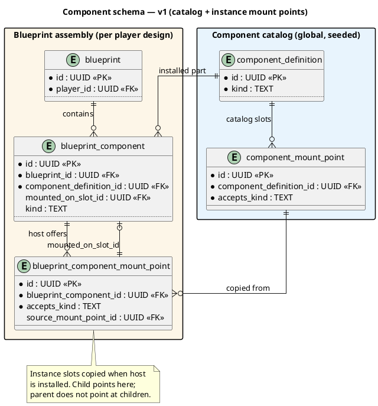

# ADR-001 - Component Model and Storage for Combat Vehicles

| Field | Value |
|-------|-------|
| **Purpose & Intent** | Decide how combat vehicle customization is represented in code and persisted in the database, balancing flexibility, validation, and balancing velocity. |
| **Incoming** | Ch. 1 gameplay flexibility goals, Ch. 2 Rust/PostgreSQL constraints, v1 tech-tree documents in doc/v1. |
| **Outgoing** | Ch. 5 building blocks (blueprint and rule engine), Ch. 6 runtime validation/stats pipeline, Ch. 8 data modeling concept. |

## Status

Accepted (Opt C); amended 2026-07-12 (mount points); amended 2026-07-14 (instance mount points)

## Date

2026-06-27 (original); 2026-07-12 (mount-point amendment); 2026-07-14 (instance mount points)

## Context

The current schema stores fixed combat stats in `basic_tank`, which is suitable for one vehicle archetype but does not scale to composable builds (`chassis -> mount -> turret -> weapon -> utility`) and compatibility rules defined in v1 documentation.

We need:
- Data-driven expansion of components without code rewrites for every new part.
- Dedicated properties for specific component kinds (for example turret rotation speed).
- Fast and explainable validation for requirements, incompatibilities, and balancing rules.

## Decision

Use a hybrid component model (Opt C):
- Generic component envelope for shared fields and rule graph behavior.
- Typed component payload per component kind for dedicated properties.
- Data-driven compatibility and dependency rules (tags + explicit rules), not inheritance trees.

For storage, use a primarily normalized schema with optional JSONB extension fields for low-frequency experimental attributes.

## Options Considered

### Option A - Deep class hierarchy with subclass-specific properties

Description:
- Represent components mainly through class inheritance (for example `Component -> Mount -> Turret`).

Pros:
- Strong compile-time typing in code.
- Simple when component set is small and stable.

Cons:
- Rigid and expensive to evolve for content-heavy systems.
- Encourages logic spread across subclasses instead of centralized rule evaluation.
- Harder to let designers/balance work mostly through data.

Decision:
- Rejected.

### Option B - Fully generic JSON document for all components

Description:
- Keep all component fields in JSONB with minimal relational structure.

Pros:
- Very flexible and quick for experimentation.
- Few migrations required for new fields.

Cons:
- Weak constraints and referential integrity.
- Harder query performance and indexing for gameplay-critical paths.
- Increased risk of runtime validation bugs.

Decision:
- Rejected as primary model.

### Option C - Normalized core + typed details + optional JSONB extensions

Description:
- Shared fields in relational tables.
- Kind-specific detail tables for dedicated properties.
- Optional `extra_json` for experimental attributes.

Pros:
- Strong integrity for ids, slots, tags, compatibility, and progression queries.
- Clear separation between shared and dedicated fields.
- Extensible without large inheritance refactors.

Cons:
- More tables and migrations than pure JSON.
- Slightly higher upfront modeling effort.

Decision:
- Accepted.

## Recommended Schema (v1)

### Scope: implement now vs. later

**Implement now** (v1 mount ticket): catalog tables (`component_definition`, `component_mount_point`) plus blueprint assembly (`blueprint`, `blueprint_component`, `blueprint_component_mount_point`). Catalog slots are **copied** to instance slots when a host is installed; children reference the parent's instance slot via `mounted_on_slot_id`. Mount rule: `child.kind = instance_slot.accepts_kind`, slot must be empty.

Authoritative ER diagram: [08_01_database_layout.md](../08_crosscutting_concepts/08_01_database_layout.md).

**Defer** (iterate later): `component_tag`, `component_requirement`, `component_incompatibility`, `component_stat_modifier`, typed detail tables (`turret_component_detail`, …), `blueprint_rule_evaluation`, and extra catalog fields (`code`, `parent_slot_code`, `power_draw`, …). See [Deferred schema](#deferred-schema) at the end of this section.

### Schema dependency diagram (v1 — implement now)



### Component catalog (implement now)

- `component_definition` — global parts catalog (`kind`, `name`, images, `price`)
- `component_mount_point` — catalog slots on a host definition (`component_definition_id`, `accepts_kind`)

### Blueprint assembly (implement now)

- `blueprint_component` — installed part; `mounted_on_slot_id` → parent's instance slot (NULL for root chassis); snapshot fields
- `blueprint_component_mount_point` — instance slots on an installed host; copied from catalog at install; optional `source_mount_point_id` for traceability

**Install (summary):**

1. Install host → insert `blueprint_component`; copy catalog mount points → `blueprint_component_mount_point` on that row.
2. Install child → pick empty instance slot where `accepts_kind = child.kind`; insert child with `mounted_on_slot_id`; copy child's catalog slots to child row.

**Mount rule:** `child.kind = blueprint_component_mount_point.accepts_kind`; slot must have no existing child.

### Schema references (v1)

| From | To | Purpose |
|------|-----|---------|
| `component_mount_point.component_definition_id` | `component_definition.id` | Catalog host |
| `blueprint_component_mount_point.blueprint_component_id` | `blueprint_component.id` | Instance host |
| `blueprint_component_mount_point.source_mount_point_id` | `component_mount_point.id` | Catalog source (optional) |
| `blueprint_component.mounted_on_slot_id` | `blueprint_component_mount_point.id` | Child → parent's slot |
| `blueprint_component.component_definition_id` | `component_definition.id` | Installed part |

**Empty-slot UI:** list `blueprint_component_mount_point` rows for the selected host where no child references the slot id.

**v1 seed target (catalog):**

| Host | `accepts_kind` |
|------|----------------|
| Tank chassis | `turret` |
| Truck chassis | `light_gun` |
| Scout turret | `heavy_gun` |

### Deferred schema

Tables and fields planned per the full Opt C model; not part of the first mount-point migration:

- `component_tag`, `component_requirement`, `component_incompatibility`, `component_stat_modifier`
- `turret_component_detail`, `weapon_component_detail`, `mobility_component_detail`
- `blueprint_rule_evaluation`
- Extra `component_definition` fields: `code`, `parent_slot_code`, `slot_type`, `base_cost`, `base_weight`, `power_draw`, `power_supply`, `extra_json`
- Extra `component_mount_point` fields: `slot_code`, `accepts_tags`, `max_children`, `required`
- Extra `blueprint_component` fields: `mount_point_code`, `mount_index` (if needed beyond instance slots)

### Full target schema (deferred — Opt C vision)

The sections below describe the longer-term model. **Do not implement in the first mount-point migration.**

#### Component catalog (full target)

- `component_definition`
  - `id UUID PK`
  - `code TEXT UNIQUE`
  - `name TEXT`
  - `kind TEXT` (`chassis`, `mount`, `turret`, `weapon`, `mobility`, `utility`, `armor`, `power`)
  - `parent_slot_code TEXT NULL`
  - `slot_type TEXT`
  - `base_cost INT`, `base_weight INT`, `power_draw INT`, `power_supply INT`
  - `extra_json JSONB NULL`
  - plus display fields as in v1 (`game_image_url`, `menu_image_url`, …)

- `component_mount_point` (extended)
  - v1 fields plus `slot_code`, `accepts_tags`, `max_children`, `required`
  - UNIQUE (`host_component_id`, `slot_code`)

- `component_tag`, `component_requirement`, `component_incompatibility`, `component_stat_modifier`

#### Typed detail tables (full target)

- `turret_component_detail`, `weapon_component_detail`, `mobility_component_detail`

#### Player blueprint assembly (full target)

- `blueprint_component` extended with `mount_point_code`, `mount_index` snapshots
- `blueprint_rule_evaluation`

## Amendment: Instance mount points (2026-07-14)

### Context

Pointing `blueprint_component` directly at catalog `component_mount_point` (including two FKs) mixed global catalog with per-blueprint installation. Workshop UI needs **instance slots** on each installed host.

### Decision

Add `blueprint_component_mount_point`: when a host is installed, copy catalog slots to instance rows on that `blueprint_component`. Children set `mounted_on_slot_id` → parent's instance slot. Parent does not reference children.

Remove catalog FKs from `blueprint_component` (`mount_point_id`, `parent_component_mount_point_id`). See [08_01_database_layout.md](../08_crosscutting_concepts/08_01_database_layout.md).

### Assembly example (v1)

```text
Tank blueprint
bc1 (chassis)  mounted_on_slot_id: NULL
  bcmp1 (instance: accepts turret)
    bc2 (Scout)  mounted_on_slot_id → bcmp1
      bcmp2 (instance: accepts heavy_gun)
        bc3 (Main Gun)  mounted_on_slot_id → bcmp2
```

## Amendment: Mount Points (2026-07-12, simplified)

> **Superseded for blueprint assembly** by [Instance mount points (2026-07-14)](#amendment-instance-mount-points-2026-07-14). Catalog table shape below still applies; children now attach via `mounted_on_slot_id` on instance slots, not catalog FKs on `blueprint_component`.

### Context

The v1 roadmap story ([TW-1](../../tickets/TW-1-allow-buying-turret-component.md): mount components on Tank/Truck blueprints) needs hosts to declare which child `kind` values they accept. Tank offers a turret slot; Truck offers a `light_gun` slot only (no turret).

### Decision

Introduce catalog table `component_mount_point` with only:

- `component_definition_id` → host part in the global catalog
- `accepts_kind` — must match the child's `component_definition.kind`

No `parent_slot_code` on children, no tags, no `max_children` column. **Slot occupancy (2026-07-14):** at most one child per instance slot — enforced by checking no existing `blueprint_component.mounted_on_slot_id` for that `blueprint_component_mount_point.id`.

### Options considered (summary)

| Option | Decision |
|--------|----------|
| Implicit kind matching only (no mount point table) | Rejected — no data-driven empty-slot UI |
| Explicit catalog mount points with `accepts_kind` only | **Accepted for v1** |
| Full slot model (`slot_code`, tags, `max_children`, child `parent_slot_code`) | Deferred — see [Deferred schema](#deferred-schema) |

### Catalog seed (v1)

| Host | `accepts_kind` |
|------|----------------|
| Tank chassis | `turret` |
| Truck chassis | `light_gun` |
| Scout turret | `heavy_gun` |

Assembly on a blueprint uses **instance** slots — see [08_01_database_layout.md](../08_crosscutting_concepts/08_01_database_layout.md).

Rule **evaluation timing** remains in [ADR-002](ADR-002-rule-evaluation-strategy-draft.md).

## Why This Fits Tank Wars

- Matches v1 graph-based assembly and tag-based compatibility.
- Supports domain-specific stats like turret rotation speed without class explosion.
- Keeps balancing mostly in data while preserving SQL constraints and queryability.

## Consequences

Positive:
- Faster content expansion and balancing iterations.
- Better testability: validator and stat aggregation can be deterministic over table data.
- Easier UI explainability for invalid builds and trade-offs.

Negative:
- More migration and data-seeding work in early development.
- Requires disciplined rule validation service boundaries.

## Migration Notes from Current Schema

Current state contains fixed columns in `basic_tank` for speed, turret speed, and machine-gun fields.

Incremental migration path:
1. Introduce `component_definition` and `blueprint_component` tables.
2. Create seed components equivalent to existing `basic_tank` capabilities.
3. **Add `component_mount_point` (catalog) and `blueprint_component_mount_point` (instance); `blueprint_component.mounted_on_slot_id`.**
4. Seed catalog mount points: Tank `turret`; Truck `light_gun`; Scout `heavy_gun`.
5. Build a validator + stat aggregator service in backend.
6. Backfill existing blueprint data: chassis rows with `mounted_on_slot_id = NULL`; copy instance slots on install.
7. Deprecate and remove `basic_tank` after parity and verification.

## Validation and Testing Impact

- Add unit tests for mount validation (`accepts_kind` match, slot already occupied).
- Add integration tests for blueprint assembly persistence and stat aggregation.
- Add fixture-based balance tests for representative archetypes (raider, brawler, sniper).

## Open Questions

- Which stats should remain persisted as denormalized cache versus computed at runtime?
- Do we need versioned component definitions for live-balance patches?
- When to add `slot_code`, tags, and `max_children` to mount points (see [Deferred schema](#deferred-schema))?
