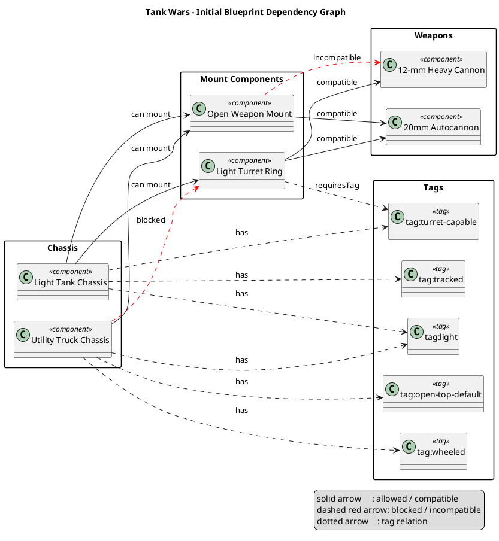
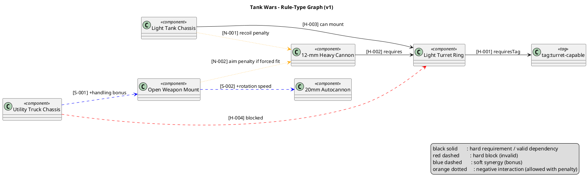

# Combat Vehicle Tech Tree - First Concrete Graph

This is the first minimal graph for component compatibility and dependency.

Included scope:
- Chassis: `Light Tank Chassis`, `Utility Truck Chassis`
- Mounts: `Open Weapon Mount`, `Light Turret Ring`
- Weapons: `20mm Autocannon`, `12-mm Heavy Cannon`

## PlantUML Graph

## Notes
- This graph intentionally keeps rules minimal so we can validate the data model first.
- Next step can add formal rule IDs (`R-001`, `R-002`) and export the same graph from JSON.

## Rule-Type Graph (Hard, Soft, Negative)

This graph uses the same first component set, but classifies relation types for balancing.

### Rule IDs
- `H-001`: `Light Turret Ring` requires `turret-capable` tag.
- `H-002`: `12-mm Heavy Cannon` requires `Light Turret Ring`.
- `H-003`: `Light Tank Chassis` can mount `Light Turret Ring`.
- `H-004`: `Utility Truck Chassis` cannot mount `Light Turret Ring`.
- `S-001`: `Utility Truck Chassis` + `Open Weapon Mount` gives handling bonus.
- `S-002`: `Open Weapon Mount` + `20mm Autocannon` gives rotation bonus.
- `N-001`: `Light Tank Chassis` + `12-mm Heavy Cannon` applies recoil penalty.
- `N-002`: `Open Weapon Mount` + `12-mm Heavy Cannon` applies aim penalty if forced fit.
